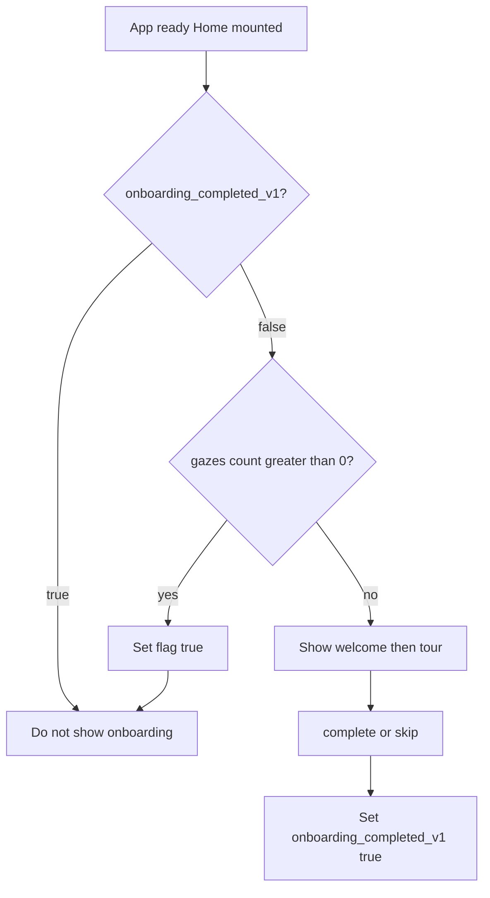
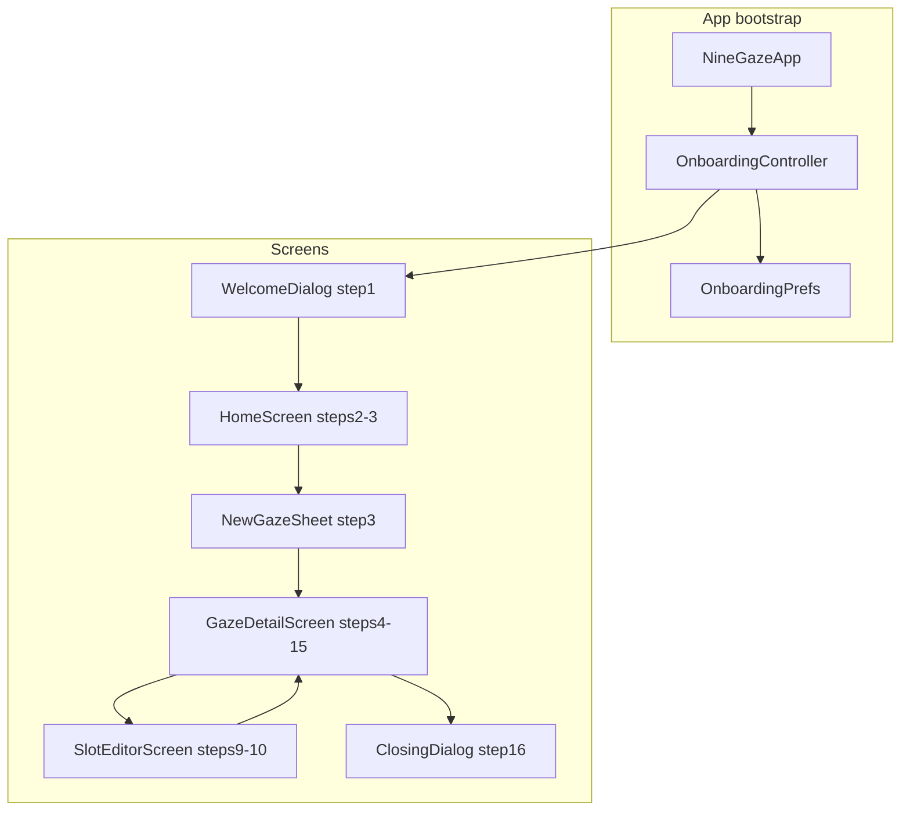

# 9Gaze User Onboarding Plan

First-install guided tour using `showcaseview`, a central step controller, and ARB copy (EN + ID). Welcome and closing screens use custom UI; in-app steps highlight real widgets across Home → Create sheet → Gaze detail → Slot editor.

## Goals

- Run **once on first install** (persist completion flag).
- Guide users through the **real app flow** (create gaze → add photos → slot editor → bulk edit → export).
- Use **showcaseview** for in-context highlights; use **full-screen dialogs** for welcome (step 1) and thank-you (step 16).
- Copy: concise, friendly, **photography / collage** tone. Match existing strings in [`lib/l10n/app_en.arb`](../../lib/l10n/app_en.arb) (`New Gaze`, `Tap to add`, `Export to Gallery`, etc.). Write like a person, not a manual: no em dashes, no stiff punctuation. **English first** in implementation; **Indonesian** in same ARB keys.

### Copy constraints (Google Play / store listing)

Onboarding strings must **not** use medical, clinical, diagnostic, or health-adjacent language. Position 9Gaze as a **photo collage and framing tool** (grid layout, face detection for crop/align, export to gallery), same framing as the rest of the app UI.

**Avoid:** clinical, patient, diagnosis, examination, medical, health, cardinal gaze directions as clinical terms, “nine-gaze” as a procedure name, em dashes, and copy that sounds like store/legal text.

**Prefer:** Match [store listing](https://play.google.com) tone: eye movement photos, labeled 3×3 grid, import from gallery, eye alignment (vertical center, horizontal fit), manual override, export composed image, offline/on-device. Use **Gaze** / **Tatapan** and **gaze direction** as in the listing; still avoid clinical/diagnostic framing (patient, examination, etc.).

**Support contact:** `9gaze@atelierkensa.com` (closing step only).

**Code comments** (e.g. [`lib/widgets/animated_gaze_face.dart`](../../lib/widgets/animated_gaze_face.dart)) may stay technical; **user-facing onboarding ARB only** follows this rule.

## Current codebase anchors

| Area | File |
|------|------|
| App entry | [`lib/main.dart`](../../lib/main.dart) — wrap with onboarding bootstrap |
| Home | [`lib/screens/home/home_screen.dart`](../../lib/screens/home/home_screen.dart), [`gaze_list_view.dart`](../../lib/screens/home/widgets/gaze_list_view.dart), [`new_gaze_button.dart`](../../lib/screens/home/widgets/new_gaze_button.dart) |
| Create sheet | [`lib/screens/home/widgets/new_gaze_sheet.dart`](../../lib/screens/home/widgets/new_gaze_sheet.dart) |
| Detail + edit modes | [`lib/screens/gaze_detail/gaze_detail_screen.dart`](../../lib/screens/gaze_detail/gaze_detail_screen.dart), [`gaze_direction_grid.dart`](../../lib/screens/gaze_detail/widgets/gaze_direction_grid.dart) |
| Slot editor | [`lib/screens/slot_editor/slot_editor_screen.dart`](../../lib/screens/slot_editor/slot_editor_screen.dart) |
| Face illustration | [`lib/widgets/animated_gaze_face.dart`](../../lib/widgets/animated_gaze_face.dart) |
| L10n | [`lib/l10n/app_en.arb`](../../lib/l10n/app_en.arb), [`lib/l10n/app_id.arb`](../../lib/l10n/app_id.arb) |

**Not present today:** `showcaseview`, `shared_preferences`, any onboarding flag.

## Eligibility and persistence (client only)

**Yes: everything stays on the device.** No accounts, no backend API, no sync. Two local sources only:

1. **`shared_preferences`** — remembers that this install should not show onboarding again.
2. **Drift / SQLite (`gazes` table)** — hard gate: if **any** gaze row exists, onboarding never runs.

### Preference flag

| Key | Type | Meaning |
|-----|------|---------|
| `onboarding_completed_v1` | `bool` | `true` = user finished the tour **or** tapped Skip tour |

Single flag for both outcomes. We do not distinguish “completed” vs “skipped” in storage; both mean “do not auto-start onboarding again.”

**Write `true` when:**

- User finishes step 24 (Done on closing dialog) → `complete()`
- User taps global **Skip tour** at any point → `skip()`
- **Grandfather pass:** app starts, gazes exist, flag still `false` → set `true` immediately (existing users never see the tour)

**Read:** once per cold start (or when `HomeScreen` first mounts), before showing welcome.

Optional later (not required for v1): `onboarding_last_step` string/int to resume a interrupted tour. Still client-only in prefs.

### `shouldShowOnboarding` (single gate)

Run this before welcome dialog or any showcase:

```dart
Future<bool> shouldShowOnboarding(AppDatabase db) async {
  final prefs = await SharedPreferences.getInstance();
  if (prefs.getBool('onboarding_completed_v1') ?? false) {
    return false;
  }

  final count = await GazesRepository(db).count(); // SELECT COUNT(*)
  if (count > 0) {
    // Existing project data: never onboard, and seal prefs so we skip DB count next launch.
    await prefs.setBool('onboarding_completed_v1', true);
    return false;
  }

  return true;
}
```



### Where this runs

- **`OnboardingPrefs`** — thin wrapper: `isCompleted()`, `markCompleted()`, `clearForDev()`.
- **`OnboardingController.startIfEligible()`** — calls `shouldShowOnboarding`, sets `isActive`, opens welcome or no-ops.
- Call from **`HomeScreen`** `initState` post-frame (after drift is up and splash gone), not before DB init. Home already has `GazesRepository` / stream; reuse same DB.

Add **`GazesRepository.count()`** (one drift `count()` query) so we do not load all rows just to check emptiness.

### Edge cases

| Case | Behavior |
|------|----------|
| Skip on step 2 | Flag `true`, tour never auto-starts again |
| Complete step 24 | Flag `true` |
| User deletes all gazes later | Flag stays `true` (no re-onboarding; avoids nagging power users) |
| Fresh install, empty DB | Tour eligible until complete/skip |
| Upgrade from old app with gazes, flag missing | Count > 0 → no tour, flag sealed `true` |
| Reinstall app | Prefs cleared, DB cleared → tour can show again (expected for “first install”) |
| Mid-tour kill app | v1: restart tour from welcome if flag still `false` and count still 0 (user may have created a gaze mid-tour; then count > 0 blocks re-show on next launch, which is acceptable) |
| User taps **Restart tutorial** in Settings | Manual replay path (below); does not require clearing prefs or empty DB |

### Manual replay vs automatic (Settings stretch goal)

Automatic first-run flow keeps the rules above. **Restart tutorial** uses a separate launch mode:

| | Automatic (`startIfEligible`) | Manual (`startTutorialReplay`) |
|--|------------------------------|--------------------------------|
| Trigger | First launch, empty DB, flag false | User chooses Settings → Restart tutorial |
| Respects `onboarding_completed_v1` | Yes | No (explicit opt-in) |
| Respects gaze count > 0 block | Yes | **No** |
| Step 2 (empty home list) | Show when count == 0 | **Skip** when count > 0 |
| Step 3 (New Gaze button) | Standard copy | Use **returning-user** copy when count > 0 (nudge to tap **New Gaze** or pick from list) |
| Sets flag on complete/skip | Yes | Yes (still `markCompleted()` so auto tour does not pop later) |

`OnboardingController` gains `OnboardingLaunchMode { automatic, manualReplay }`. Eligibility helper only applies to `automatic`.

### Dev / QA

- `OnboardingPrefs.clearForDev()` or long-press reset: clears **only** the pref, not gazes. To test tour again, use empty DB (delete app data or delete all gazes **and** clear pref).
- Document in plan: full replay needs empty `gazes` table **and** `onboarding_completed_v1 == false`.

## Architecture



### Core modules (new)

1. **`lib/services/onboarding/onboarding_prefs.dart`** — wraps `onboarding_completed_v1`; `markCompleted()` used for complete, skip, and grandfather pass (+ `clearForDev()`).
2. **`lib/services/onboarding/onboarding_step.dart`** — enum of all steps (see phases below).
3. **`lib/services/onboarding/onboarding_controller.dart`** — `ChangeNotifier`:
   - `currentStep`, `isActive`, `tutorialSlotKey` (slot filled in step 7, reused in 9–10).
   - `startIfEligible()` — runs `shouldShowOnboarding` (prefs + gaze count).
   - `advance({OnboardingStep? to})`, `skip()` and `complete()` both call `markCompleted()`.
   - Registers `GlobalKey`s per target; exposes `startShowcaseForCurrentStep()` / `dismissShowcase()`.
4. **`lib/widgets/onboarding/onboarding_scope.dart`** — `InheritedNotifier<OnboardingController>` at app root.
5. **`lib/widgets/onboarding/onboarding_showcase.dart`** — thin wrapper: reads step + l10n, applies consistent tooltip styling (`Showcase.withWidget` or `Showcase` + theme colors from [`lib/app/theme.dart`](../../lib/app/theme.dart)).
6. **`lib/widgets/onboarding/welcome_onboarding_page.dart`** — step 1 (not showcase).
7. **`lib/widgets/onboarding/complete_onboarding_page.dart`** — step 16.

### showcaseview integration

- Add deps: `showcaseview`, `shared_preferences`.
- In [`HomeScreen`](../../lib/screens/home/home_screen.dart): post-frame `OnboardingController.startIfEligible()` (prefs flag **and** `GazesRepository.count() == 0`); if eligible → welcome dialog; on Next → `homeEmptyList`.
- `ShowcaseView.register()` once per app lifecycle (in controller or `NineGazeApp` stateful wrapper); `unregister()` on dispose.
- **Per-step showcase**, not one giant `startShowCase([...30 keys])` across routes — controller dismisses then restarts with **one key** (or small batch on same screen) after navigation / user action.
- **Action-gated steps** (user must tap real UI):
  - `disableDefaultTargetGestures: false`, `disposeOnTap: true`, hide default Next via `hideActionWidgetForShowcase` / custom tooltip with no Next.
  - Hook existing handlers: `NewGazeButton.onPressed`, grid slot tap, edit icon, etc. call `controller.onTargetActivated()` → advance → post-frame `startShowcaseForCurrentStep()`.
- **Explain-only steps**: custom tooltip with **Got it** → `ShowcaseView.get().next(force: true)` or controller `advance()`.
- Global **Skip tour** via `globalFloatingActionWidget` → `skip()` + persist.
- `enableAutoScroll: true` on detail screen for lower sections (flags, detail block).

### Onboarding gaze data

- User creates a **real** gaze during the tour (matches spec). No fake DB row.
- Suggested default name in hint only (optional prefill `"My first gaze"` / `"Gaze pertamaku"`).
- Track `tutorialSlotKey` when first photo lands (step 7) for highlight in steps 9–10.

---

## Implementation phases (reviewable PR slices)

### Phase 0 — Foundation

- pubspec deps + `OnboardingPrefs` / `OnboardingStep` / `OnboardingController` / `OnboardingScope`.
- `GazesRepository.count()` for eligibility.
- Wire `startIfEligible()` from `HomeScreen` (prefs + empty gazes table).
- ARB keys for all strings (EN + ID below).
- Dev-only: long-press home title → reset onboarding (optional, small).

**Review:** flag persists; welcome shows once; skip marks complete.

### Phase 1 — Welcome (Step 1)

- Full-screen dialog / route: `AnimatedGazeFace` (animated, ~120px), title, body, **Next**.
- Next → `homeEmptyList` + start home showcases.

**Review:** branding matches app; no showcase on welcome.

### Phase 2 — Home (Steps 2–3)

- Wrap empty-state area in `GazeListView` with showcase (explain empty list).
- Wrap `NewGazeButton` — **tap required** to open sheet.
- `NewGazeSheet`: showcases on name field, notes field, create button — **create tap required**; on success existing navigation to `GazeDetailScreen` fires → controller step `detailGridIntro`.

**Review:** cannot proceed without opening sheet + creating gaze.

### Phase 3 — Gaze detail intro (Steps 4–8)

- `GazeDirectionGrid`: showcase over grid (slots empty).
- Explain single vs multi pick (copy only, then **tap slot** gate).
- Showcases on Compact + Dual toggles — mutual exclusivity copy.
- Showcase on gaze detail / Update section.
- After picker returns: explain auto face align (copy); then fine-tune paths (slot editor vs detail edit mode) — copy before step 9.

**Review:** toggles still work; showcase dismisses before image picker.

### Phase 4 — Photo pick + slot editor (Steps 7–10)

- Step 7: highlight one grid cell (e.g. `SlotKey.primary`); on pick + insert set `tutorialSlotKey`.
- Step 8: overlay tooltip on filled slot (auto-center caveat).
- Step 9: **tap same filled slot** → `SlotEditorScreen`.
- Step 10: sequential showcases on canvas, undo/redo, reset, recenter, replace, save — mix **try it** gates (undo/redo/save) and **Got it** for tool explanations.

**Review:** return to detail after save; slot transform persisted.

### Phase 5 — Bulk edit (Steps 11–14)

- Top-right edit `IconButton`: tap to enter menu.
- Menu bar: reposition | rearrange | text — explain trio.
- Sub-flows:
  - Reposition: enter mode → try gesture → save → undo/redo mention.
  - Rearrange: swap → save.
  - Text: add → move/resize/style → save → exit edit mode.

**Review:** `_editStage` transitions match controller steps; exiting edit returns to normal detail.

### Phase 6 — Export + close (Steps 15–16)

- Showcase bottom **Export to Gallery** button.
- On export success (or tap after attempt): closing dialog with thank you and support email `9gaze@atelierkensa.com`.
- `complete()` → persist flag.

**Review:** second app launch skips entire tour.

---

## Step index (controller enum)

| ID | Step | Screen | Gate |
|----|------|--------|------|
| 1 | welcome | dialog | Next |
| 2 | homeEmptyList | home | Got it |
| 3 | homeCreateButton | home | tap Create |
| 4 | createName | sheet | Got it |
| 5 | createNotes | sheet | Got it |
| 6 | createSubmit | sheet | tap Create |
| 7 | detailSlotsGrid | detail | Got it |
| 8 | detailPickSlot | detail | tap slot + pick photo |
| 9 | detailAutoAlign | detail | Got it |
| 10 | detailFineTuneIntro | detail | Got it |
| 11 | detailCompactDual | detail | Got it |
| 12 | detailInfoEdit | detail | Got it |
| 13 | detailTapFilledSlot | detail | tap filled slot |
| 14 | slotEditorGestures | slot editor | try gesture |
| 15 | slotEditorUndoRedo | slot editor | undo + redo |
| 16 | slotEditorTools | slot editor | Got it each tool |
| 17 | slotEditorSave | slot editor | tap Save |
| 18 | detailBulkEditButton | detail | tap Edit |
| 19 | detailEditMenu | detail | Got it |
| 20 | detailReposition | detail | save |
| 21 | detailRearrange | detail | save |
| 22 | detailText | detail | save + exit edit |
| 23 | detailExport | detail | tap Export |
| 24 | complete | dialog | Done |

16 user-facing “steps” map to ~24 controller substeps for cleaner gates.

---

## Implementation checklist

- [x] Phase 0 — Foundation (deps, controller, ARB, bootstrap)
- [x] Phase 1 — Welcome dialog
- [x] Phase 2 — Home + create sheet
- [x] Phase 3 — Gaze detail intro
- [x] Phase 4 — Photo pick + slot editor
- [x] Phase 5 — Bulk edit
- [x] Phase 6 — Export + complete dialog

---

## Copy — English (`app_en.arb` keys: `onboarding_*`)

Tone aligned with Play Store listing: practical, import-and-assign workflow, eye alignment wording, offline/on-device where relevant.

### Step 1: Welcome

- **Title:** Welcome to 9Gaze
- **Body:** Import your eye movement photos from the gallery and arrange them into a clean, labeled 3×3 grid. Auto-alignment handles the framing; you can fine-tune any slot. Export one composed image when you are done.
- **CTA:** Next

### Step 2: Home empty list

- **Title:** Your saved grids
- **Body:** Each gaze you create appears here. You have not made one yet. Tap the blue button below to start your first labeled grid.

### Step 3: Create button

- **Title:** Create a gaze
- **Body:** Tap **New Gaze** to name your grid and begin importing photos.

### Step 4: Name field

- **Title:** Name this gaze
- **Body:** Only a name is required. Choose something you will recognize in the list.

### Step 5: Notes

- **Title:** Notes (optional)
- **Body:** Optional notes for your own reference, such as a session label or date.

### Step 6: Create

- **Title:** Open your grid
- **Body:** Tap **Create Gaze**. You will assign photos to each labeled slot next.

### Step 7: Slots grid

- **Title:** Nine labeled slots
- **Body:** Each slot matches a gaze direction. Tap a slot to import one photo from your gallery. Select several photos at once and 9Gaze fills empty slots in order.

### Step 8: Pick a photo

- **Title:** Import from gallery
- **Body:** Tap a slot (centre is a good first pick) and choose one or more photos. No in-app camera needed.

### Step 9: Auto face align

- **Title:** Automatic eye alignment
- **Body:** 9Gaze detects the eye in each photo, centers it vertically, and fits the image to the horizontal boundaries of the slot so every cell looks consistently framed.

### Step 10: Fine-tune options

- **Title:** Manual override
- **Body:** Auto-alignment is not perfect on every photo. Open a slot for full control, or use **Edit** on this screen to adjust positions in the grid.

### Step 11: Compact & Dual Primary

- **Title:** Layout options
- **Body:** **Compact Mode** uses shorter slot cells. **Dual Primary** splits the centre slot into top and bottom. Only one layout option can be active at a time.

### Step 12: Gaze details

- **Title:** Gaze details
- **Body:** The name and notes for this grid are here. Tap **Update** to change them anytime.

### Step 13: Open slot editor

- **Title:** Fine-tune this slot
- **Body:** Tap the slot you just filled. You can adjust position, zoom, and rotation on the next screen.

### Step 14: Slot editor gestures

- **Title:** Adjust the framing
- **Body:** Pinch to zoom, drag to pan, twist to rotate. Try a small adjustment if auto-alignment needs a nudge.

### Step 15: Undo / redo

- **Title:** Undo and redo
- **Body:** Tap **Undo** to step back, then **Redo** if you want to restore a change.

### Step 16: Editor tools

- **Title:** Slot tools
- **Body:** **Recenter** runs automatic eye alignment again. **Reset** clears manual edits from this session. **Replace** imports a different photo for this slot.

### Step 17: Save slot

- **Title:** Save this slot
- **Body:** Tap **Save** to return to your gaze grid.

### Step 18: Bulk edit entry

- **Title:** Edit the full grid
- **Body:** Tap **Edit** (top right) to reposition slots, rearrange photos, or add text overlays.

### Step 19: Edit menu

- **Title:** Three ways to edit
- **Body:** **Reposition** adjusts each slot’s image. **Rearrange** swaps photos between slots. **Texts** adds labels on the composed grid.

### Step 20: Reposition mode

- **Title:** Reposition
- **Body:** Nudge any slot’s framing, then tap **Save**. **Undo** and **Redo** are available here too.

### Step 21: Rearrange mode

- **Title:** Rearrange
- **Body:** Drag one slot onto another to swap photos. Tap **Save** when the order looks right.

### Step 22: Text mode

- **Title:** Add text
- **Body:** Tap **Add Text**, then move, scale, and style your label. Tap **Save**, then exit edit mode.

### Step 23: Export

- **Title:** Export your grid
- **Body:** Tap **Export to Gallery** to save the finished 3×3 composed image to your photo library. Ready to share in seconds.

### Step 24: Complete

- **Title:** You are ready
- **Body:** That is the full workflow: import, assign, auto-align, fine-tune, export. Everything stays on your device. Questions or feedback? Email 9gaze@atelierkensa.com.
- **CTA:** Done

### Step 3 (manual replay only, when gazes exist)

- **Title:** Run the tutorial again
- **Body:** Your saved gazes are listed below. Tap **New Gaze** to walk through import and export again, or open an existing gaze to practice editing.

---

## Copy — Indonesian (`app_id.arb`)

Mirror EN tone; reuse existing ARB button labels (**Tatapan Baru**, **Ketuk untuk tambah**, **Ekspor ke Galeri**, **Ubah Posisi**, etc.). Same listing voice; avoid clinical/diagnostic Indonesian (*pasien*, *klinis*, *pemeriksaan*, *medis*).

### Step 1

- **Title:** Selamat datang di 9Gaze
- **Body:** Impor foto gerakan mata dari galeri dan susun menjadi grid 3×3 berlabel yang rapi. Penjajaran otomatis mengatur bingkai; Anda bisa menyesuaikan slot mana pun. Ekspor satu gambar komposit jika sudah selesai.
- **CTA:** Lanjut

### Step 2

- **Title:** Grid tersimpan Anda
- **Body:** Setiap tatapan yang Anda buat muncul di sini. Belum ada. Ketuk tombol biru di bawah untuk memulai grid berlabel pertama.

### Step 3

- **Title:** Buat tatapan
- **Body:** Ketuk **Tatapan Baru** untuk memberi nama grid dan mulai mengimpor foto.

### Step 4

- **Title:** Nama tatapan ini
- **Body:** Hanya nama yang wajib. Pilih nama yang mudah dikenali di daftar.

### Step 5

- **Title:** Catatan (opsional)
- **Body:** Catatan opsional untuk referensi Anda, misalnya label sesi atau tanggal.

### Step 6

- **Title:** Buka grid Anda
- **Body:** Ketuk **Buat Tatapan**. Berikutnya Anda menetapkan foto ke setiap slot berlabel.

### Step 7

- **Title:** Sembilan slot berlabel
- **Body:** Setiap slot sesuai arah tatapan. Ketuk slot untuk mengimpor satu foto dari galeri. Pilih beberapa foto sekaligus dan 9Gaze mengisi slot kosong berurutan.

### Step 8

- **Title:** Impor dari galeri
- **Body:** Ketuk slot (tengah adalah pilihan awal yang baik) dan pilih satu atau beberapa foto. Tidak perlu kamera di aplikasi.

### Step 9

- **Title:** Penjajaran mata otomatis
- **Body:** 9Gaze mendeteksi mata di setiap foto, menengahkan secara vertikal, dan menyesuaikan gambar ke batas horizontal slot agar setiap sel terlihat konsisten.

### Step 10

- **Title:** Penyesuaian manual
- **Body:** Penjajaran otomatis tidak selalu pas di setiap foto. Buka slot untuk kontrol penuh, atau gunakan **Ubah** di layar ini untuk menggeser posisi di grid.

### Step 11

- **Title:** Opsi tata letak
- **Body:** **Mode pendek** memakai sel slot yang lebih rendah. **Dua tatapan tengah** membelah slot tengah menjadi atas dan bawah. Hanya satu opsi tata letak yang aktif.

### Step 12

- **Title:** Detail tatapan
- **Body:** Nama dan catatan grid ini ada di sini. Ketuk **Perbarui** untuk mengubahnya kapan saja.

### Step 13

- **Title:** Sesuaikan slot ini
- **Body:** Ketuk slot yang baru Anda isi. Di layar berikutnya Anda bisa mengatur posisi, zoom, dan rotasi.

### Step 14

- **Title:** Atur bingkai
- **Body:** Cubit untuk zoom, geser untuk pindah, putar untuk rotasi. Coba penyesuaian kecil jika penjajaran otomatis perlu dibetulkan.

### Step 15

- **Title:** Undo dan redo
- **Body:** Ketuk **Undo** untuk mundur, lalu **Redo** jika ingin mengembalikan perubahan.

### Step 16

- **Title:** Alat slot
- **Body:** **Tengahkan** menjalankan penjajaran mata otomatis lagi. **Reset** menghapus edit manual sesi ini. **Ganti** mengimpor foto lain untuk slot ini.

### Step 17

- **Title:** Simpan slot ini
- **Body:** Ketuk **Simpan** untuk kembali ke grid tatapan Anda.

### Step 18

- **Title:** Ubah seluruh grid
- **Body:** Ketuk **Ubah** (kanan atas) untuk menggeser slot, menukar foto, atau menambah teks overlay.

### Step 19

- **Title:** Tiga cara mengubah
- **Body:** **Posisi** menyesuaikan gambar tiap slot. **Susunan** menukar foto antar slot. **Teks** menambah label di grid komposit.

### Step 20

- **Title:** Posisi
- **Body:** Sesuaikan bingkai slot mana pun, lalu ketuk **Simpan**. **Undo** dan **Redo** juga tersedia di sini.

### Step 21

- **Title:** Susunan
- **Body:** Seret satu slot ke slot lain untuk menukar foto. Ketuk **Simpan** jika urutannya sudah benar.

### Step 22

- **Title:** Tambah teks
- **Body:** Ketuk **Tambah Teks**, lalu pindahkan, ubah skala, dan gaya label Anda. Ketuk **Simpan**, lalu keluar dari mode ubah.

### Step 23

- **Title:** Ekspor grid Anda
- **Body:** Ketuk **Ekspor ke Galeri** untuk menyimpan grid 3×3 jadi satu gambar di perpustakaan foto. Siap dibagikan dalam hitungan detik.

### Step 24

- **Title:** Anda siap
- **Body:** Itu alur lengkapnya: impor, tetapkan slot, penjajaran otomatis, sesuaikan, ekspor. Semua tetap di perangkat Anda. Ada pertanyaan? Email 9gaze@atelierkensa.com.
- **CTA:** Selesai

### Step 3 (manual replay only, when gazes exist)

- **Title:** Jalankan tutorial lagi
- **Body:** Tatapan tersimpan Anda ada di daftar di bawah. Ketuk **Tatapan Baru** untuk mengulang impor dan ekspor, atau buka tatapan yang ada untuk berlatih mengedit.

---

## Risks and mitigations

| Risk | Mitigation |
|------|------------|
| Showcase not visible over modal bottom sheet | Register showcase on sheet root; dismiss home showcase before `showModalBottomSheet` |
| User backs out mid-tour | `WillPopScope` / `PopScope`: confirm skip or resume same step |
| Detail edit modes block highlights | Controller pauses showcase while picker open; resume on `Navigator.pop` |
| iOS photo permission fail | Step 8 copy mentions permission; do not block tour, allow skip |
| Re-install doesn’t replay | Flag in prefs is enough for “first install” per device |
| Manual replay while user has gazes | Skip empty-home step; use returning copy; do not rely on auto eligibility |

## Testing checklist

- Fresh install / cleared prefs + empty `gazes`: full 24-step path completes.
- Skip on step 2: flag set, never auto-shows again.
- DB with 1+ gazes, flag false: no tour, flag auto-sealed (grandfather).
- DB with 0 gazes, flag true: no tour.
- Kill app mid-tour: resumes or restarts from last persisted substep (optional `onboarding_last_step` key).
- EN / ID locale: all `onboarding_*` strings render.
- Copy review: no medical/clinical terms in any `onboarding_*` ARB string.
- Compact + Dual toggles during step 11 don’t break mutual exclusion.
- Export step on Android + iOS saves to gallery (existing `GazeExporter` path).

## Suggested PR order

1. Phase 0 + Phase 1 (foundation + welcome + ARB)
2. Phase 2 (home + create sheet)
3. Phase 3–4 (detail + slot editor)
4. Phase 5–6 (bulk edit + export + complete)
5. **Stretch:** Phase 7 (home header + Settings menu + manual replay)

---

## Stretch goal: Settings menu (Phase 7)

Optional follow-up after core onboarding ships. Still **client-only**.

### Home header layout ([`home_top_bar.dart`](../../lib/screens/home/widgets/home_top_bar.dart))

Today: title left, animated face **right**. Target:

```text
[face]  9Gaze                    [menu]
```

- **Left:** existing 48×48 bordered `AnimatedGazeFace` (moved from right).
- **Center-left:** `9Gaze` title (same typography; add small gap after icon).
- **Right:** settings control (see below).

Use `Row` + `Spacer()` between title block and trailing action. Keep horizontal padding 16.

### Settings entry UI

For **two actions**, prefer a trailing **`IconButton`** with `Icons.menu` (hamburger; still the usual pattern for “more / app menu” on mobile) that opens a **`PopupMenuButton`** or anchored menu sheet. Avoid a full navigation drawer (heavy for two items). Material 3 apps often use menu icon → popup or bottom sheet; either is fine.

**Accessibility:** `tooltip` / `Semantics(label: l10n.settings)` on the button.

### Settings items (v1)

| Item | Behavior |
|------|----------|
| **Restart tutorial** | `OnboardingController.startTutorialReplay()`. Welcome dialog (step 1) still shows; skip step 2 if `gazes.count > 0`; continue from create-button step with returning-user copy. Does **not** clear `onboarding_completed_v1` before start. |
| **About App** | Simple screen or dialog: app name, version (`package_info_plus` or `pubspec` constant), short blurb, support email `9gaze@atelierkensa.com`. No medical positioning in copy. |

Wire menu from [`HomeScreen`](../../lib/screens/home/home_screen.dart) (owns `OnboardingController` scope).

### New files / changes (stretch)

- Refactor [`HomeTopBar`](../../lib/screens/home/widgets/home_top_bar.dart): `onMenuPressed` or embed `PopupMenuButton` in trailing slot.
- `lib/screens/settings/about_app_sheet.dart` (or screen).
- ARB: `settings`, `restartTutorial`, `aboutApp`, `onboarding_homeCreateReturning` (EN/ID for manual replay step 3).
- `OnboardingController.startTutorialReplay()` + branch in step router for skipped step 2.

### Manual replay copy (extra ARB keys)

**Step 3 (when gazes exist), EN example:**

- **Title:** Pick up where you left off
- **Body:** Your gazes are in the list below. Tap **New Gaze** to walk through the full flow again, or open any gaze to revisit the editor and export steps.

**ID example:**

- **Title:** Lanjutkan dari daftar Anda
- **Body:** Tatapan Anda ada di daftar di bawah. Ketuk **Tatapan Baru** untuk mengulang alur lengkap, atau buka tatapan mana saja untuk latihan edit dan ekspor.

### Stretch testing

- Header: icon left, menu right, title visible on small phones.
- Restart tutorial with 0 gazes: same path as first run (includes empty list step).
- Restart tutorial with 1+ gazes: no step 2; step 3 returning copy; tour can proceed through create or user opens existing gaze (document if opening existing gaze is out of scope for v1 stretch: default = still push through **New Gaze** for linear tour).
- About App shows version and email.
- After manual replay complete/skip, auto tour still does not appear on next cold start.

### Stretch checklist

- [x] Phase 7a: `HomeTopBar` layout + menu affordance
- [x] Phase 7b: Settings popup + About App
- [x] Phase 7c: `startTutorialReplay()` + skip step 2 when count > 0 + returning copy
